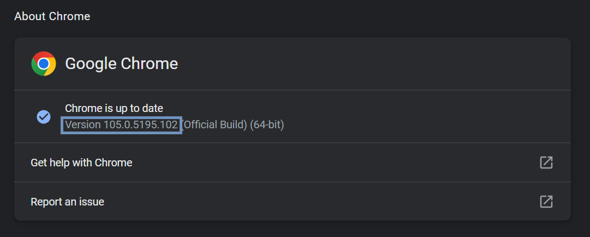

# Jitsi Music Bot
A chat-based music bot for Jitsi meetings that allows users to enjoy music in a meeting by typing simple English commands in the meeting chat box. The bot joins the meeting as a participant and follows the commands in the chat box.

---

## Commands
The following commands can be used in the chat box to control the music bot:

-   `/play` `<songName>`

    -   Plays a song. (replace <songName> with the name of the song)

-   `/pause`

    -    Pauses the song being played.

-   `/resume`

    -   Resumes playback of the song that is paused.

-	`/exit`

	-	Remove Music bot from the meeting and quit the web driver.

-   `/help`
    -   Retrieves list of all supported commands.
 
---

## Built With
* Python
* JavaScript
* Selenium
* tkinter

---

## Instructions to set up the project:
* Install [Google Chrome](https://www.google.com/intl/en_in/chrome/). Ignore if already installed.

* Download [Chromium Chromedriver](https://chromedriver.chromium.org/downloads) corresponding to the chrome version that you have installed in your system. You can check your chrome version by visiting this [link](chrome://settings/help) from a chrome window.
<p align="center">

</p>

* Install a Virtual Audio Device. [VB-Audio](https://vb-audio.com/Cable/) and [BlackHole](https://github.com/ExistentialAudio/BlackHole) are the ones currently supported.

* Install [Python 3.7+](https://www.python.org/downloads/) if you don't have it already installed.

* Install Selenium by running the following command in terminal:
```
pip install selenium
```

* Open the project directory in terminal and run the following command in terminal:
```
python jitsiBot.py
```

* In the window that opens, enter the link to the meeting that you want the bot to join and also the path to the chromedriver.exe (you might need to extract the compressed file) you downloaded in the first step. And click Start Bot.
<p align="center">

</p>